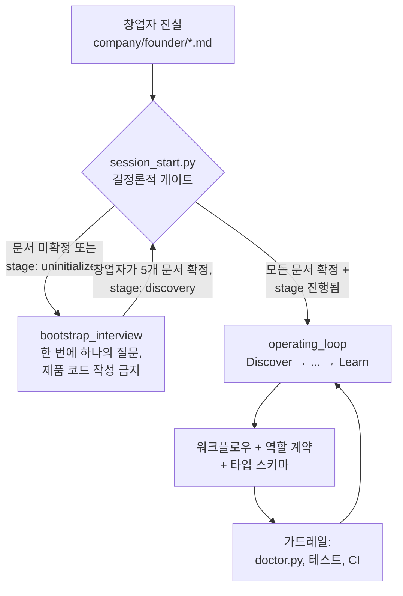

# AI Company Starter

[](https://github.com/jangjun7091/ai-company/actions/workflows/ai-company-guardrails.yml)
[](https://github.com/jangjun7091/ai-company/releases)
[](LICENSE)
[](https://github.com/jangjun7091/ai-company/stargazers)

**[English →](README.md)**

창업자가 AI 에이전트 팀과 함께 회사를 운영하기 위한, 특정 모델·도구에 종속되지 않는 운영체계 템플릿입니다. 문제 발견부터 프로덕션 학습까지를 다룹니다.

## 핵심 아이디어

**저장소가 곧 회사입니다**: 회사의 기억, 계약, 운영 규칙이 모두 Git에 있습니다.

- LLM은 교체 가능한 지능입니다.
- 코딩 에이전트(Claude Code, Codex, Copilot, Cursor, 그리고 앞으로 나올 무엇이든)는 교체 가능한 실행 환경입니다.
- 모델이 바뀌어도 살아남는 것은 Git에 있는 것들입니다: 창업자의 진실, 고객 증거, 결정, 품질 기준, 평가(eval), 학습 기록.

운영 루프는 다음과 같습니다:

`Discover → Decide → Specify → Build → Verify → Release → Observe → Learn`

## 동작 방식



모든 세션은 모델이 아니라 저장소에 물어보는 것으로 시작합니다: `python scripts/session_start.py --json`이 현재 모드를 결정론적으로 반환합니다. 창업자가 5개의 창업자 문서를 직접 확정하기 전까지 에이전트는 인터뷰만 하고 구현하지 않습니다.

## 템플릿 사용법

GitHub에서 **Use this template** 버튼을 누르거나:

```bash
gh repo create my-company --template jangjun7091/ai-company --private --clone
cd my-company
python scripts/doctor.py
python scripts/session_start.py --json
```

그다음 선호하는 코딩 에이전트에서 저장소를 열고 이렇게 시작합니다:

> Start the company workflow. Follow AGENTS.md and the session-start output. Do not write product code until the bootstrap interview and Definition of Ready are complete.

Python 3.10+ 표준 라이브러리만 사용합니다 — 설치할 의존성이 없습니다. Windows에서는 `python` 명령을 직접 실행하세요. `Makefile`은 선택 사항이며 GNU Make가 필요합니다.

## 부트스트랩 탈출

게이트는 기계적입니다. 감이 아닙니다:

1. 창업자와 함께 각 창업자 문서를 완성한 뒤, 해당 문서의 `Status:` 줄을 `Status: confirmed`로 변경합니다.
2. `company/state/project-state.yaml`의 `stage:`를 `uninitialized`에서 `discovery`로 변경합니다.
3. `python scripts/session_start.py --json`을 다시 실행하면 모드가 `operating_loop`가 됩니다.

문서를 confirmed로 표시하는 근거는 오직 창업자의 명시적 승인뿐입니다.

## 규칙

1. 창업자 진실, 제품 결정, 명세, 테스트, 증거, 학습은 Git에 남깁니다.
2. 벤더별 파일은 어댑터일 뿐, 정본이 될 수 없습니다.
3. 에이전트는 제안하고 실행합니다. 비전, 고객 진실, 품질, 위험, 되돌릴 수 없는 결정은 창업자가 소유합니다.
4. 프로덕션 장애와 사용자 피드백은 재현 가능한 증거, 평가, 또는 갱신된 운영 규칙이 되어야 합니다.
5. 더 강한 모델이라도 범위, 증거, 승인, 품질 게이트를 우회할 수 없습니다.

## 저장소 구조

- `AGENTS.md` — 모든 에이전트를 위한 정본 지침.
- `ai-company.yaml` — 운영 매니페스트, 게이트, 어휘 정의.
- `company/founder/` — 창업자가 소유한 원천 진실 (5개 문서).
- `company/agents/` — 특정 LLM에 독립적인 역할 계약.
- `company/workflows/` — 부트스트랩 인터뷰, idea-to-release, founder-doc-revision, incident-to-learning, 주간 리뷰.
- `company/schemas/` — 타입이 정의된 핸드오프 계약 (task, decision, escalation, evidence).
- `company/state/` — 세션 시작 시 기계가 읽는 현재 라이프사이클 상태.
- `templates/` — 스키마와 연결된 재사용 산출물 양식.
- `docs/` — 명세, 결정, 리서치, 인시던트, 런북, 학습 원장.
- `scripts/` — 결정론적 검사 (`doctor.py`, `session_start.py`).
- `adapters/`, `CLAUDE.md`, `.claude/`, `.github/`, `.cursor/` — 얇은 호환 계층.

## 지원 에이전트

| 환경 | 어댑터 |
| --- | --- |
| Codex | `AGENTS.md`를 직접 읽음 |
| Claude Code | `CLAUDE.md` + `.claude/skills/` |
| GitHub Copilot | `.github/copilot-instructions.md` |
| Cursor | `.cursor/rules/ai-company.mdc` |
| 그 외 무엇이든 | `AGENTS.md`를 읽게 하면 됨 |

## 권장 도입 순서

1. 부트스트랩 인터뷰와 창업자 문서 작성.
2. 기능 하나를 Idea Brief → Spec → Task → PR → 검증까지 완주.
3. 프로덕션 텔레메트리와 피드백 수집 연결.
4. incident-to-learning 루프 가동.
5. 다중 에이전트 역할과 오케스트레이션/컨트롤 센터 런타임 도입.

## 로드맵과 기여

방향은 [ROADMAP.md](ROADMAP.md)에 있습니다. 진행 중인 작업은
[issues](https://github.com/jangjun7091/ai-company/issues)에 있으며,
[`good first issue`](https://github.com/jangjun7091/ai-company/issues?q=is%3Aissue+is%3Aopen+label%3A%22good+first+issue%22)
라벨부터 시작하면 좋습니다. 변경을 보내는 방법은 [CONTRIBUTING.md](CONTRIBUTING.md),
템플릿을 세션에 걸쳐 유지·개선하는 방법은 [MAINTAINING.md](MAINTAINING.md)를 참조하세요.

이 템플릿이 반나절을 아껴줬다면, ⭐ 하나가 다른 사람들에게 도움이 됩니다.

## 라이선스

MIT — [LICENSE](LICENSE)를 참조하세요. 이 템플릿으로 만든 회사는 당신의 것입니다: 파생 저장소는 비공개로 유지하거나 원하는 대로 재라이선스할 수 있습니다.
