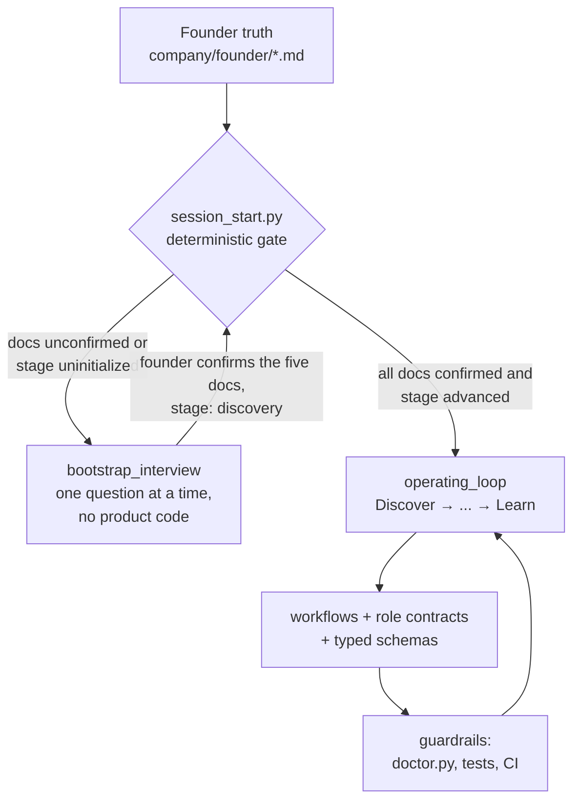

# AI Company Starter

[](https://github.com/jangjun7091/ai-company/actions/workflows/ai-company-guardrails.yml)
[](https://github.com/jangjun7091/ai-company/releases)
[](LICENSE)
[](https://github.com/jangjun7091/ai-company/stargazers)

**[한국어 안내 →](README.ko.md)**

A model- and tool-neutral operating system template for a founder running a company with AI agent teammates — from problem discovery through production learning.

## Core idea

The **repository is the company**: its memory, its contracts, and its operating rules.

- LLMs are replaceable intelligence.
- Coding agents (Claude Code, Codex, Copilot, Cursor, or whatever ships next) are replaceable execution environments.
- What survives model upgrades is what lives in Git: founder truth, customer evidence, decisions, quality bars, evals, and learnings.

The operating loop is:

`Discover → Decide → Specify → Build → Verify → Release → Observe → Learn`

## How it works



Every session starts by asking the repository, not the model, what to do: `python scripts/session_start.py --json` returns the current mode deterministically. Until the founder has personally confirmed the five founder documents, agents interview — they do not implement.

## Use this template

Click **Use this template** on GitHub, or:

```bash
gh repo create my-company --template jangjun7091/ai-company --private --clone
cd my-company
python scripts/doctor.py
python scripts/session_start.py --json
```

Then open the repository in your preferred coding agent and say:

> Start the company workflow. Follow AGENTS.md and the session-start output. Do not write product code until the bootstrap interview and Definition of Ready are complete.

Requires Python 3.10+ with the standard library only — nothing to install. On Windows, run the `python` commands directly; the `Makefile` is optional and needs GNU Make.

## Leaving bootstrap

The gate is mechanical, not vibes:

1. Complete each founder document with the founder, then set its `Status:` line to `Status: confirmed`.
2. Set `stage:` in `company/state/project-state.yaml` from `uninitialized` to `discovery`.
3. Re-run `python scripts/session_start.py --json` — the mode becomes `operating_loop`.

Only the founder's explicit approval justifies marking a document confirmed.

## Rules

1. Founder truth, product decisions, specifications, tests, evidence, and learnings live in Git.
2. Vendor-specific files are adapters, never the canonical source.
3. Agents propose and execute; the founder owns vision, customer truth, quality, risk, and irreversible decisions.
4. Production incidents and user feedback must become reproducible evidence, evaluations, or updated operating rules.
5. Stronger models do not bypass scope, evidence, approval, or quality gates.

## Repository map

- `AGENTS.md` — canonical instructions for all agents.
- `ai-company.yaml` — operating manifest, gates, and vocabularies.
- `company/founder/` — founder-owned source of truth (five documents).
- `company/agents/` — role contracts independent of any LLM.
- `company/workflows/` — bootstrap interview, idea-to-release, founder-doc-revision, incident-to-learning, weekly review.
- `company/schemas/` — typed handoff contracts (task, decision, escalation, evidence).
- `company/state/` — current lifecycle state, machine-read at session start.
- `templates/` — reusable artifacts wired to the schemas.
- `docs/` — specs, decisions, research, incidents, runbooks, and the learning ledger.
- `scripts/` — deterministic checks (`doctor.py`, `session_start.py`).
- `adapters/`, `CLAUDE.md`, `.claude/`, `.github/`, `.cursor/` — thin compatibility layers.

## Supported agents

| Environment | Adapter |
| --- | --- |
| Codex | reads `AGENTS.md` directly |
| Claude Code | `CLAUDE.md` + `.claude/skills/` |
| GitHub Copilot | `.github/copilot-instructions.md` |
| Cursor | `.cursor/rules/ai-company.mdc` |
| Anything else | point it at `AGENTS.md` |

## Recommended adoption order

1. Bootstrap interview and founder documents.
2. One feature through Idea Brief → Spec → Task → PR → Verification.
3. Production telemetry and feedback ingestion.
4. Incident-to-learning loop.
5. Multiple agent roles and an orchestration/control-center runtime.

## Roadmap and contributing

Where this is going: [ROADMAP.md](ROADMAP.md). Open work lives in
[issues](https://github.com/jangjun7091/ai-company/issues) — look for
[`good first issue`](https://github.com/jangjun7091/ai-company/issues?q=is%3Aissue+is%3Aopen+label%3A%22good+first+issue%22).
See [CONTRIBUTING.md](CONTRIBUTING.md) to send a change, and
[MAINTAINING.md](MAINTAINING.md) for how the template is maintained across sessions.

If the template saves you an afternoon, a ⭐ helps others find it.

## License

MIT — see [LICENSE](LICENSE). Companies built from this template are yours: keep your derived repository private or relicense it as you wish.
